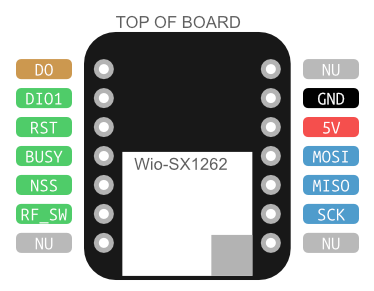

# LoRa SX1262 Tranciever Arduino Proof-of-Concept

The goal of this is to quickly produce a proof-of-concept of LoRa using the SX1262 and do some initial viability testing ensuring that this solution is feasible for our wireless telemetry project.

***IMPORTANT NOTE:** This project is only compatible with the Arduino Mega, originally it was going to be compatible with the uno and other boards, but it turns out the RadioLib is quite large and memory heavy, so keep this in mind as I only realized this hours into the project. Oops* 

*Development/Dev Board refers to the XIAO WIO-SX1262 board from Seeed Studio. Module refers to the solderable WIO-SX1262 from Seeed Studio. Chip/IC refers to the tranciever SX1262 chip from Semtech.*

## Seeed Studio WIO-SX1262 Development Board

The development board consists of header pins, SX-1262 module, SPI series resistors, and a single button. The button does not relate to the module in any way and just connects to ground the DO pin which is usually pulled high to 3v3 through a 10k resistor. The NU pins below are not used and act as a simple passthrough for the XIAO system which the board was originally designed for. The RF_SW pin, which must be driven by the controller, determines whether the Rx or Tx circuitry is active. When recieving, line must be set high, otherwise (during Tx), must be set low.  

### Links
* [Seeed Studio Store: WIO-SX1262 for XIAO](https://www.seeedstudio.com/Wio-SX1262-for-XIAO-p-6379.html)
* [WIO-SX1262 for XIAO: Board Schematic](https://files.seeedstudio.com/products/SenseCAP/Wio_SX1262/Wio-SX1262%20for%20XIAO%20V1.0_SCH.pdf)
* [WIO-SX1262: Wiki Documentation](https://wiki.seeedstudio.com/wio_sx1262/)

## Semtech SX1262 LoRa Tranciever Chip

The SX1626 chip from Semtech allows for sub-GHz LoRa radio trancieving. The chip is commonly used for sensors, remote control and Internet of Things applications. 

### Useful Pin Descriptions
* **BUSY** - Out - Pin indicates to host controller whether the SX1262 is ready to recieve further SPI commands or needs to wait. The line will be pulled low when the SX1262 is ready to recieve more commands, and pulled high when the controller needs to wait to send more commands.
* **DIO1** - In/Out - A generic interrupt request pin which allows for any interrupt to be sent to the microcontroller. Some examples are TxDone (Packet transmission complete), RxDone (Packet Recieved).
* **NRST** - In - Pin allows a complete "factory reset" of the device. Any options must be re-sent and calibration will be rerun.

### Links

* [Semtech SX1262 Product Page](https://www.semtech.com/products/wireless-rf/lora-connect/sx1262)
* [Semtech SX1262 Datasheet PDF](https://semtech.my.salesforce.com/sfc/p/E0000000JelG/a/RQ000008nKCH/hp2iKwMDKWl34g1D3LBf_zC7TGBRIo2ff5LMnS8r19s?__hstc=212684107.6e106f52ef1717d9f14d66ec3cbd7859.1758844446212.1759341587863.1763928021683.5&__hssc=212684107.1.1763928021683&__hsfp=3732782242)

## Setup

Two separate, identical setups, consisting each of an Arduino, a WIO-SX1262 dev board, and an appropriate antenna for the frequencies. 

### Hardware

Connect the module headers to the appropriate pins listed below. Also, connect the antenna to the IPEX connector on the module. Afterwards, connect the Arduino to a computer and follow the software setup. 

| ***WIO-SX1262 Dev Board Pin (Module Pin)*** | ***Arduino Mega 2560 Pin*** | **Function** |
| :------------- | :--------------- | :------------------------- |
| **3v3** (8) | 3v3 | Power Supply (3.3V) |
| **GND** (7) | GND | Ground |
| **BUSY** (11) | D6 | Busy Signal of SX1262 |
| **DIO1** (12) | D7 | Multipurpose DIO of SX1262 |
| **NRST** (5) | D8 | SX1262 Reset (active low) |
| **RF\_SW** (1) | D9 | RF Switch (high is rx, low is tx) |
| **SPI\_NSS/CS** (6) | D53 | Chip Select (SS) |
| **SPI\_MOSI/COPI** (3) | D51 | Master Out / Slave In |
| **SPI\_MISO/CIPO** (2) | D50 | Master In / Slave Out |
| **SPI\_SCK** (4) | D52 | Serial Clock |

### Software

PlatformIO was used to develop this code, thus it is recommended to use it to build and run the code. Alternatively, the standard Arduino IDE can be used to build and run the code, skip to the Arduino IDE section below.

#### Arduino IDE

1. Ensure the proper libraries are installed, see dependancies section.
2. Open the main code file at `src/main.cpp`
3. Select the appropriate board and upload code to device.

## Basic Usage

1. Connect both Arduinos to separate computers. Perform the same following operations on both devices.
2. Open up serial monitor of choice with a baud rate of 9600 connected to the board. A serial monitor is required before the device will complete initialization.
3. Configure settings through serial monitor commands
4. Send transmissions and recive messages.

